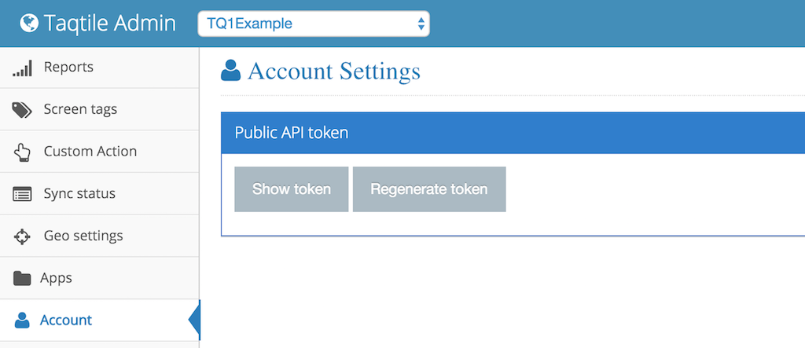

##Authentication

Now you can retrieve the jwt token directly from the TQ1 Admin portal to authenticate all your requests. Therefore you don't need to know anymore your `jwt secret` in order to do an authenticated operation. There is a screenshot below of the portal to make it easier to identify where is this feature located.



The client initialization was updated to reflect this change. Only two arguments are required: `applicationKey` and `jwtToken`. The first hasn't changed and it's the identifier of your target app and the latter is the token you have just acquired in our Admin portal.

Example:

```csharp
string applicationKey = "f54d4a2c3b6543226fbe74e55074a531a4b62b28";
string jwtToken = "eyJhbGciOiJIUzI1NiIsInR5cCI6IkpXVCJ9.eyJzIjoiMSJ9.Drra7WLy2QVV6B_uF0WEEGbv2-AGXH0ZxyXpklF6nxM";

TQ1Client client = new TQ1Client(applicationKey, jwtToken);
```

##Application Metadata

The request is still the same, but the response has changed.

Example:

```csharp
var responseMetadata = client.FetchMetadata();
```

On the previous version the returned `responseMetadata` had the following fields: `Id`, `Carriers`, `Countries`, `Custom`, `Platforms` and `Token`.

Now on v3, only the fields `Custom` and `Platforms` are not null since they are the filters currently available for push notification segmentation. Note that the `Platforms` field before was an object with subfields for each mobile platform and listing also all the versions found. The same field now is an array with the mobile platforms. Below you can see an example of how to access those fields:

Example:

```csharp
var custom = responseMetadata.Custom;
var platforms = responseMetadata.Platforms;
```

##Application Screen Tags

The method used to access all screen tags created for an application is identical, but the structure of the response was reshaped.

Example:

```csharp
var responseScreenTags = client.FetchScreenTags();
```

The adjustment here was the extraction of the `Data` field. Before the object returned had only this attribute with the array of keys inside it. The method now returns directly an array with the screen tags available.

##Push Notification

The arguments are exactly the same, but the method `SchedulePushNotification` returns always a null object.


##Exclusive Push Notification

Again the arguments didn't change. Previously the response object had the attributes: `Data` and `Token`. The new version contains just the field `GroupId`.